# Data Flow

- [Data Flow](#data-flow)
  - [Entry point](#entry-point)
  - [Batch Processing](#batch-processing)
  - [Forward](#forward)
  - [Memory Usage](#memory-usage)
  - [Computational Hotspots](#computational-hotspots)
  - [Visualization](#visualization)

## Entry point

```
main() → argument parsing → build_transformer() → read_tokenizer() → build_sampler()
    ↓
Mode selection: generate|chat|getp
    ↓
getp() [if batch mode]
```

## Batch Processing

```
getp() → read_inputfile() → build_requests()
    ↓
warm_up() [⚠️ EMPTY - OPTIMIZE HERE]
    ↓
inference() → for each request: simple_getp_generate()
    ↓                              ↓
finish() [⚠️ EMPTY]               encode() → generation loop → forward() → sample()
    ↓                              ↓
write_outputfile()                 store output tokens
```

## Forward

```
forward() → token embedding lookup
    ↓
for each layer:
    ↓
    rmsnorm() → matmul(QKV) → apply_rotary_emb() → multi_head_attention()
    ↓                ↓                     ↓              ↓
    [norm]      [🔥 EXPENSIVE]      [position]     [🔥 VERY EXPENSIVE]
    ↓
    attention_output() → residual_connection()
    ↓
    rmsnorm() → matmul(router) → topk() → expert_processing()
    ↓              ↓              ↓           ↓
    [norm]    [🔥 EXPENSIVE]   [selection]  [🔥 VERY EXPENSIVE]
    ↓
    expert_aggregation() → residual_connection()
    ↓
[repeat for all layers]
    ↓
final_rmsnorm() → matmul(output) → logits
                       ↓
                 [🔥 MOST EXPENSIVE]
```

## Memory Usage

```
Model Weights: ~20GB-120GB (memory-mapped, read-only)
KV Cache: n_layers × seq_len × kv_dim × sizeof(float) × batch_size
    Example: 32 layers × 4096 seq × 128 kv_dim × 4 bytes × 8 batch = 512MB per request
Activations: ~hidden_dim × multiple buffers = ~10-100MB per request
```

## Computational Hotspots

1. Matrix Multiplications (80% of time):

- QKV projections: `hidden_dim × (n_heads × head_dim)`
- Attention outputs: `(n_heads × head_dim) × hidden_dim`
- MoE projections: `hidden_dim × (2 × intermediate_dim)` per expert
- Final output: `hidden_dim × vocab_size`

2. Attention Computation (15% of time):

- Q·K^T: `seq_len × seq_len × n_heads × head_dim`
- Attention×V: `seq_len × n_heads × head_dim`

3. Memory Bandwidth (5% of time):

- KV cache access
- Weight loading
- Activation transfers

## Modularization

```mermaid
graph TD
    %% Entry Point
    Start([Program Start]) --> Main[main - run.cpp:1099]

    %% Initialization Phase
    Main --> ParseArgs[Parse Command Line Arguments]
    ParseArgs --> InitTransformer[build_transformer - run.cpp:285]
    ParseArgs --> InitTokenizer[read_tokenizer - tokenizer.cpp:49]
    ParseArgs --> InitSampler[build_sampler - sampler.cpp:build_sampler_oss]

    %% Transformer Initialization
    InitTransformer --> LoadCheckpoint[load_checkpoint - run.cpp]
    LoadCheckpoint --> MemoryMapWeights[memory_map_weights - run.cpp]
    LoadCheckpoint --> MallocRunState[malloc_run_state - run.cpp]

    %% Mode Selection
    InitTransformer --> ModeCheck{Mode Selection}
    InitTokenizer --> ModeCheck
    InitSampler --> ModeCheck

    %% Three Execution Modes
    ModeCheck -->|"mode=='generate'"| GenerateMode[generate - run.cpp:886]
    ModeCheck -->|"mode=='chat'"| ChatMode[chat - run.cpp:985]
    ModeCheck -->|"mode=='getp'"| GetpMode[getp - getp_run.cpp]

    %% Generate Mode Flow
    GenerateMode --> EncodePrompt1[encode - tokenizer.cpp:encode]
    EncodePrompt1 --> GenLoop{Generation Loop}
    GenLoop --> ForwardPass1[forward_cpu - forward.cpp:204]
    ForwardPass1 --> Sample1[sample_oss - sampler.cpp:sample_oss]
    Sample1 --> Decode1[decode_piece - tokenizer.cpp:decode_piece]
    Decode1 --> PrintToken1[Print Token]
    PrintToken1 --> CheckSteps1{Steps < Max?}
    CheckSteps1 -->|Yes| GenLoop
    CheckSteps1 -->|No| Cleanup

    %% Chat Mode Flow
    ChatMode --> ReadInput[Read User Input]
    ReadInput --> FormatPrompt[Format Chat Prompt]
    FormatPrompt --> EncodePrompt2[encode - tokenizer.cpp:encode]
    EncodePrompt2 --> ChatLoop{Chat Generation Loop}
    ChatLoop --> ForwardPass2[forward_cpu - forward.cpp:204]
    ForwardPass2 --> Sample2[sample_oss - sampler.cpp:sample_oss]
    Sample2 --> Decode2[decode_piece - tokenizer.cpp:decode_piece]
    Decode2 --> PrintToken2[Print Token]
    PrintToken2 --> CheckSteps2{Steps < Max?}
    CheckSteps2 -->|Yes| ChatLoop
    CheckSteps2 -->|No| ReadInput

    %% Getp Mode Flow
    GetpMode --> WarmUp[warm_up - getp_run.cpp:13]
    WarmUp --> GetpEval[getp_eval - getp_eval.cpp]
    GetpEval --> SimpleGenerate[simple_getp_generate - getp_run.cpp:31]
    SimpleGenerate --> EncodePrompt3[encode - tokenizer.cpp:encode]
    EncodePrompt3 --> GetpLoop{Getp Generation Loop}
    GetpLoop --> ForwardPass3[forward_cpu - forward.cpp:204]
    ForwardPass3 --> Sample3[sample_oss - sampler.cpp:sample_oss]
    Sample3 --> StoreToken[Store Output Token]
    StoreToken --> CheckSteps3{Steps < Max?}
    CheckSteps3 -->|Yes| GetpLoop
    CheckSteps3 -->|No| FinishGetp[finish - getp_run.cpp:22]
    FinishGetp --> Cleanup

    %% Forward Pass Detail (Core Inference)
    ForwardPass1 --> TokenEmbedding[Token Embedding Lookup]
    ForwardPass2 --> TokenEmbedding
    ForwardPass3 --> TokenEmbedding

    TokenEmbedding --> LayerLoop{For Each Layer}
    LayerLoop --> AttentionNorm[rmsnorm_cpu - forward.cpp:10]
    AttentionNorm --> QKVProjection[QKV Projection - matmul_cpu]
    QKVProjection --> RoPE[apply_rotary_emb_cpu - forward.cpp:37]
    RoPE --> MultiHeadAttn[Multi-Head Attention]

    MultiHeadAttn --> AttentionCalc[Attention Score Calculation]
    AttentionCalc --> SoftmaxAttn[softmax_cpu - forward.cpp:26]
    SoftmaxAttn --> ValueAggregation[Weighted Value Aggregation]
    ValueAggregation --> OutputProjection[Output Projection - matmul_cpu]
    OutputProjection --> ResidualAdd1[Residual Connection]

    ResidualAdd1 --> FFNNorm[rmsnorm_cpu - MLP norm]
    FFNNorm --> Router[Router Network - matmul_cpu]
    Router --> TopK[topk_cpu - forward.cpp:20]
    TopK --> ExpertSelection{For Each Selected Expert}

    ExpertSelection --> MLP1[MLP1 Projection - matmul_cpu]
    MLP1 --> SwiGLU[SwiGLU Activation]
    SwiGLU --> MLP2[MLP2 Projection - matmul_cpu]
    MLP2 --> ExpertWeight[Apply Expert Weight]
    ExpertWeight --> ExpertAgg[Aggregate Expert Outputs]
    ExpertAgg --> ResidualAdd2[Residual Connection]

    ResidualAdd2 --> NextLayer{More Layers?}
    NextLayer -->|Yes| LayerLoop
    NextLayer -->|No| FinalNorm[Final rmsnorm_cpu]
    FinalNorm --> Classifier[Classifier - matmul_cpu]
    Classifier --> ReturnLogits[Return Logits]

    %% Sampling Detail
    Sample1 --> SampleType{Sampling Type}
    Sample2 --> SampleType
    Sample3 --> SampleType

    SampleType -->|"temperature=0"| ArgMax[sample_argmax_oss - sampler.cpp:9]
    SampleType -->|"topp>0"| TopP[sample_topp_oss - sampler.cpp:45]
    SampleType -->|"temperature>0"| Multinomial[sample_mult_oss - sampler.cpp:22]

    TopP --> SortProbs[Sort Probabilities]
    SortProbs --> CumulativeSum[Cumulative Sum]
    CumulativeSum --> SelectToken[Select Token]

    ArgMax --> SelectToken
    Multinomial --> SelectToken
    SelectToken --> ReturnToken[Return Token ID]

    %% Tokenization Detail
    EncodePrompt1 --> FindTokens[find_token_id - tokenizer.cpp:17]
    EncodePrompt2 --> FindTokens
    EncodePrompt3 --> FindTokens
    FindTokens --> BPEEncode[encode_piece_bytes_bpe - tokenizer.cpp:37]
    BPEEncode --> TokenArray[Return Token Array]

    Decode1 --> TokenLookup[Token to String Lookup]
    Decode2 --> TokenLookup
    TokenLookup --> SafePrint[safe_printf - tokenizer.cpp:44]

    %% Cleanup
    Cleanup --> FreeSampler[free_sampler - sampler.cpp]
    FreeSampler --> FreeTokenizer[free_tokenizer - tokenizer.cpp]
    FreeTokenizer --> FreeTransformer[free_transformer - run.cpp]
    FreeTransformer --> End([Program End])

    %% Additional Components
    DecodeStandalone[decode.cpp - Standalone Token Decoder]
    DecodeStandalone --> DecodeMain[main - decode.cpp:22]
    DecodeMain --> ReadTokenFile[Read Token File]
    ReadTokenFile --> DecodeTokens[Decode Each Token]
    DecodeTokens --> PrintDecoded[Print Decoded Text]

    %% Styling
    classDef mainFlow fill:#e1f5fe,stroke:#01579b,stroke-width:2px
    classDef forward fill:#fff3e0,stroke:#e65100,stroke-width:2px
    classDef sampling fill:#f3e5f5,stroke:#4a148c,stroke-width:2px
    classDef tokenizer fill:#e8f5e8,stroke:#1b5e20,stroke-width:2px
    classDef modes fill:#fff8e1,stroke:#f57f17,stroke-width:2px

    class Main,ParseArgs,InitTransformer,InitTokenizer,InitSampler,ModeCheck,Cleanup mainFlow
    class ForwardPass1,ForwardPass2,ForwardPass3,TokenEmbedding,LayerLoop,AttentionNorm,MultiHeadAttn,FFNNorm,Router,TopK,FinalNorm forward
    class Sample1,Sample2,Sample3,SampleType,ArgMax,TopP,Multinomial sampling
    class EncodePrompt1,EncodePrompt2,EncodePrompt3,FindTokens,BPEEncode,Decode1,Decode2,TokenLookup tokenizer
    class GenerateMode,ChatMode,GetpMode modes
```



### Legacy

1. General flow

   ```mermaid
   graph TD
       A["`**main() in run.cpp**
       Command Line Parsing
       -m getp -i input.txt -o output.txt`"] --> B["`**Build Core Components**
       1. build_transformer() - Load model weights
       2. read_tokenizer() - Load tokenizer
       3. build_sampler() - Init sampling`"]

       B --> C{"`**Mode Selection**`"}
       C -->|generate| D["`**generate()**
       Single prompt → completion`"]
       C -->|chat| E["`**chat()**
       Interactive conversation`"]
       C -->|getp| F["`**getp() in getp_eval.cpp**
       Batch processing for throughput`"]

       F --> G["`**read_inputfile()**
       Load batch of input prompts
       → Requests struct`"]

       G --> H["`**Requests Structure**
       • num_reqs: Number of prompts
       • str_reqs: Raw text prompts
       • tok_gens: Output token buffers
       • max_seq_len: Sequence limit`"]

       H --> I["`**🔥 WARM-UP PHASE 🔥**
       warm_up(transformer, tokenizer)
       ⚠️ CURRENTLY EMPTY - OPTIMIZE HERE!
       • Pre-allocate GPU memory
       • Load model to GPU
       • Initialize kernels`"]

       I --> J["`**⚡ INFERENCE PHASE ⚡**
       inference(transformer, tokenizer, sampler, requests)
       📊 TIMED FOR THROUGHPUT MEASUREMENT`"]

       J --> K["`**Current Sequential Processing**
       for each request:
         simple_getp_generate()`"]

       K --> L["`**simple_getp_generate() Flow**
       1. encode(prompt) → token_ids
       2. for each position:
          • forward(transformer, token, pos)
          • sample(logits) → next_token
       3. Store output tokens`"]

       L --> M["`**forward() - Core Transformer**
       🧠 HEAVY COMPUTATION HERE
       • Token embedding lookup
       • For each layer:
         - RMSNorm → Attention
         - MoE routing → Expert selection
         - Residual connections
       • Output logits`"]

       M --> N["`**🔄 Back to Sequential Loop**
       Process next request...
       ❌ NO BATCHING
       ❌ NO GPU USAGE
       ❌ NO PARALLELISM`"]

       N --> O["`**write_outputfile()**
       Save generated token sequences
       to output file`"]

       O --> P["`**🧹 FINISH PHASE 🧹**
       finish(transformer, tokenizer)
       ⚠️ CURRENTLY EMPTY - CLEANUP HERE!
       • Free GPU memory
       • Unload kernels`"]

       P --> Q["`**Performance Report**
       📈 Throughput: tokens/sec
       ⏱️ Elapsed time`"]

       style I fill:#ff9999,stroke:#ff0000,stroke-width:3px
       style J fill:#ffeb99,stroke:#ff6600,stroke-width:3px
       style K fill:#ff9999,stroke:#ff0000,stroke-width:2px
       style L fill:#99ccff,stroke:#0066cc,stroke-width:2px
       style M fill:#cc99ff,stroke:#6600cc,stroke-width:3px
       style N fill:#ff9999,stroke:#ff0000,stroke-width:2px
       style P fill:#ff9999,stroke:#ff0000,stroke-width:3px
   ```

2. Pipeline flow

   ```mermaid
   graph LR
       subgraph "`**INPUT DATA FLOW**`"
           A["`**input.txt**
           N
           prompt1
           prompt2
           ...
           promptN`"] --> B["`**Requests Structure**
           📦 Container for batch data`"]

           B --> C["`**str_reqs**
           Raw text prompts
           [prompt1][prompt2]...[promptN]`"]

           B --> D["`**tok_gens**
           Output token buffers
           [tokens1][tokens2]...[tokensN]`"]
       end

       subgraph "`**CORE MODEL COMPONENTS**`"
           E["`**Transformer**
           🧠 Model weights & config
           • Config: vocab_size, n_layers, etc.
           • Weights: embeddings, attention, MLP
           • State: activations, KV cache`"]

           F["`**Tokenizer**
           🔤 Text ↔ Token conversion
           • encode(): text → token_ids
           • decode(): token_ids → text`"]

           G["`**Sampler**
           🎲 Token selection
           • Temperature, top-p
           • Random number generation`"]
       end

       subgraph "`**PROCESSING PIPELINE**`"
           H["`**FOR EACH REQUEST:**
           1. Get str_req[i]`"] --> I["`**encode()**
           text → token_ids
           [101, 2023, 345, ...]`"]

           I --> J["`**Generation Loop**
           pos = 0 to max_seq_len`"]

           J --> K["`**forward()**
           🔥 MOST EXPENSIVE
           token, pos → logits
           [0.1, 0.05, 0.8, ...]`"]

           K --> L["`**sample()**
           logits → next_token
           select based on temperature/top-p`"]

           L --> M["`**Store in tok_gens[i]**
           Accumulate output tokens`"]

           M --> N{"`More positions?`"}
           N -->|Yes| J
           N -->|No| O["`**Next Request**`"]
           O --> H
       end

       subgraph "`**OPTIMIZATION TARGETS**`"
           P["`**❌ CURRENT BOTTLENECKS**
           • Sequential request processing
           • CPU-only computation
           • No memory reuse
           • Single-threaded forward()`"]

           Q["`**✅ OPTIMIZATION OPPORTUNITIES**
           • Batch multiple requests
           • GPU acceleration (HIP kernels)
           • Multi-GPU parallelism
           • Efficient KV cache management
           • OpenMP threading`"]
       end

       subgraph "`**OUTPUT**`"
           R["`**output.txt**
           token_id1 token_id2 ... \\n
           token_id1 token_id2 ... \\n
           ...`"] --> S["`**decode (separate tool)**
           Convert token IDs back to text
           for human reading`"]
       end

       C --> H
       D --> M
       E --> K
       F --> I
       G --> L
       M --> R

       style P fill:#ff9999,stroke:#ff0000,stroke-width:2px
       style Q fill:#99ff99,stroke:#00cc00,stroke-width:2px
       style K fill:#ffcc99,stroke:#ff6600,stroke-width:3px
   ```

3. Model architecture

   ```mermaid
   graph TD
       A["`**Input Token**
       token_id (e.g., 1337)`"] --> B["`**Token Embedding**
       embedding_table[token_id]
       → hidden_dim vector`"]

       B --> C["`**Layer Loop**
       for l = 0 to n_layers-1`"]

       C --> D["`**RMSNorm (Attention)**
       Normalize activations`"]

       D --> E["`**QKV Projection**
       🔥 EXPENSIVE: matmul + bias
       hidden_dim → (q,k,v) heads`"]

       E --> F["`**RoPE (Rotary Embedding)**
       Apply position encoding
       with YaRN scaling`"]

       F --> G["`**Multi-Head Attention**
       🔥 VERY EXPENSIVE
       • Q·K^T attention scores
       • Softmax normalization
       • Weighted V aggregation
       • Grouped Query Attention (GQA)`"]

       G --> H["`**Attention Output**
       matmul + bias + residual`"]

       H --> I["`**RMSNorm (MLP)**
       Normalize for feed-forward`"]

       I --> J["`**MoE Router**
       🔥 EXPENSIVE: matmul + bias
       Select top-k experts`"]

       J --> K["`**Expert Processing**
       For each selected expert:
       🔥 VERY EXPENSIVE
       • Gate/Up projection (2×intermediate_dim)
       • SwiGLU activation
       • Down projection`"]

       K --> L["`**Expert Aggregation**
       Weighted sum of expert outputs
       + residual connection`"]

       L --> M{"`More layers?`"}
       M -->|Yes| C
       M -->|No| N["`**Final RMSNorm**
       Normalize final activations`"]

       N --> O["`**Output Projection**
       🔥 EXPENSIVE: matmul
       hidden_dim → vocab_size logits`"]

       O --> P["`**Sampling**
       • Apply temperature
       • Softmax → probabilities
       • Top-p or argmax selection`"]

       subgraph "`**Memory Systems**`"
           Q["`**KV Cache**
       key_cache[layer][pos][kv_dim]
       value_cache[layer][pos][kv_dim]
       🔥 HUGE MEMORY USAGE`"]

           R["`**Activations**
           • x: current activations
           • qkv: attention projections
           • expert buffers
           🔥 TEMPORARY MEMORY`"]
       end

       subgraph "`**Computational Hotspots**`"
           S["`**🔥 Matrix Multiplications**
           • QKV projections
           • Attention output
           • MoE gate/up/down
           • Final output
           ⚡ GPU ACCELERATION TARGET`"]

           T["`**🔥 Attention Computation**
           • Q·K^T (sequence × heads)
           • Attention × V
           ⚡ MEMORY BANDWIDTH BOUND`"]

           U["`**🔥 Expert Selection**
           • Router computation
           • Top-k sorting
           • Conditional execution
           ⚡ BATCHING OPPORTUNITY`"]
       end

       F --> Q
       G --> Q
       E --> R
       K --> R

       style S fill:#ff6666,stroke:#cc0000,stroke-width:3px
       style T fill:#ff6666,stroke:#cc0000,stroke-width:3px
       style U fill:#ff6666,stroke:#cc0000,stroke-width:3px
       style Q fill:#ffcc99,stroke:#ff6600,stroke-width:2px
       style R fill:#ffcc99,stroke:#ff6600,stroke-width:2px
   ```
