<div align="center">

# gpt-oss inference engine

[🌊 flow](#flow) | [🖥️ slurm](#slurm-cluster) | [⚒️ build & run](#build--run) | 🤗 <a href="https://huggingface.co/collections/openai/gpt-oss-68911959590a1634ba11c7a4">hf</a> | 📑 <a href="https://openai.com/index/introducing-gpt-oss/">blog</a> |


</div>

## abstract

This repository implements an inference serving system for **gpt-oss** models (20B & 120B) using a minimal C/C++ runtime derived from `llama2.c`. It targets **single-node, multi-GPU** execution on AMD MI250 with custom HIP kernels, and supports CPU execution with OpenMP/pthreads.

- **Baseline:** CPU-only C/C++ code (single-prompt, greedy decoding)
- **Extension:** HIP GPU execution and multi-GPU parallelism on a single node

---

### goals

- ✅ **Correctness first** — keep simple checks/metrics to verify output validity.
- 🚀 **Throughput** — maximize tokens/sec via CPU threading + HIP GPU kernels.
- 📚 **Scope** — single node, multi-GPU execution for 20B and 120B models.

---

## flow

```mermaid
graph TD
    %% Entry Point
    Start([Program Start]) --> Main[main - run.cpp:1099]

    %% Initialization Phase
    Main --> ParseArgs[Parse Command Line Arguments]
    ParseArgs --> InitTransformer[build_transformer - run.cpp:285]
    ParseArgs --> InitTokenizer[read_tokenizer - tokenizer.cpp:49]
    ParseArgs --> InitSampler[build_sampler - sampler.cpp:build_sampler_oss]

    %% Transformer Initialization
    InitTransformer --> LoadCheckpoint[load_checkpoint - run.cpp]
    LoadCheckpoint --> MemoryMapWeights[memory_map_weights - run.cpp]
    LoadCheckpoint --> MallocRunState[malloc_run_state - run.cpp]

    %% Mode Selection
    InitTransformer --> ModeCheck{Mode Selection}
    InitTokenizer --> ModeCheck
    InitSampler --> ModeCheck

    %% Three Execution Modes
    ModeCheck -->|"mode=='generate'"| GenerateMode[generate - run.cpp:886]
    ModeCheck -->|"mode=='chat'"| ChatMode[chat - run.cpp:985]
    ModeCheck -->|"mode=='getp'"| GetpMode[getp - getp_run.cpp]

    %% Generate Mode Flow
    GenerateMode --> EncodePrompt1[encode - tokenizer.cpp:encode]
    EncodePrompt1 --> GenLoop{Generation Loop}
    GenLoop --> ForwardPass1[forward_cpu - forward.cpp:204]
    ForwardPass1 --> Sample1[sample_oss - sampler.cpp:sample_oss]
    Sample1 --> Decode1[decode_piece - tokenizer.cpp:decode_piece]
    Decode1 --> PrintToken1[Print Token]
    PrintToken1 --> CheckSteps1{Steps < Max?}
    CheckSteps1 -->|Yes| GenLoop
    CheckSteps1 -->|No| Cleanup

    %% Chat Mode Flow
    ChatMode --> ReadInput[Read User Input]
    ReadInput --> FormatPrompt[Format Chat Prompt]
    FormatPrompt --> EncodePrompt2[encode - tokenizer.cpp:encode]
    EncodePrompt2 --> ChatLoop{Chat Generation Loop}
    ChatLoop --> ForwardPass2[forward_cpu - forward.cpp:204]
    ForwardPass2 --> Sample2[sample_oss - sampler.cpp:sample_oss]
    Sample2 --> Decode2[decode_piece - tokenizer.cpp:decode_piece]
    Decode2 --> PrintToken2[Print Token]
    PrintToken2 --> CheckSteps2{Steps < Max?}
    CheckSteps2 -->|Yes| ChatLoop
    CheckSteps2 -->|No| ReadInput

    %% Getp Mode Flow
    GetpMode --> WarmUp[warm_up - getp_run.cpp:13]
    WarmUp --> GetpEval[getp_eval - getp_eval.cpp]
    GetpEval --> SimpleGenerate[simple_getp_generate - getp_run.cpp:31]
    SimpleGenerate --> EncodePrompt3[encode - tokenizer.cpp:encode]
    EncodePrompt3 --> GetpLoop{Getp Generation Loop}
    GetpLoop --> ForwardPass3[forward_cpu - forward.cpp:204]
    ForwardPass3 --> Sample3[sample_oss - sampler.cpp:sample_oss]
    Sample3 --> StoreToken[Store Output Token]
    StoreToken --> CheckSteps3{Steps < Max?}
    CheckSteps3 -->|Yes| GetpLoop
    CheckSteps3 -->|No| FinishGetp[finish - getp_run.cpp:22]
    FinishGetp --> Cleanup

    %% Forward Pass Detail (Core Inference)
    ForwardPass1 --> TokenEmbedding[Token Embedding Lookup]
    ForwardPass2 --> TokenEmbedding
    ForwardPass3 --> TokenEmbedding

    TokenEmbedding --> LayerLoop{For Each Layer}
    LayerLoop --> AttentionNorm[rmsnorm_cpu - forward.cpp:10]
    AttentionNorm --> QKVProjection[QKV Projection - matmul_cpu]
    QKVProjection --> RoPE[apply_rotary_emb_cpu - forward.cpp:37]
    RoPE --> MultiHeadAttn[Multi-Head Attention]

    MultiHeadAttn --> AttentionCalc[Attention Score Calculation]
    AttentionCalc --> SoftmaxAttn[softmax_cpu - forward.cpp:26]
    SoftmaxAttn --> ValueAggregation[Weighted Value Aggregation]
    ValueAggregation --> OutputProjection[Output Projection - matmul_cpu]
    OutputProjection --> ResidualAdd1[Residual Connection]

    ResidualAdd1 --> FFNNorm[rmsnorm_cpu - MLP norm]
    FFNNorm --> Router[Router Network - matmul_cpu]
    Router --> TopK[topk_cpu - forward.cpp:20]
    TopK --> ExpertSelection{For Each Selected Expert}

    ExpertSelection --> MLP1[MLP1 Projection - matmul_cpu]
    MLP1 --> SwiGLU[SwiGLU Activation]
    SwiGLU --> MLP2[MLP2 Projection - matmul_cpu]
    MLP2 --> ExpertWeight[Apply Expert Weight]
    ExpertWeight --> ExpertAgg[Aggregate Expert Outputs]
    ExpertAgg --> ResidualAdd2[Residual Connection]

    ResidualAdd2 --> NextLayer{More Layers?}
    NextLayer -->|Yes| LayerLoop
    NextLayer -->|No| FinalNorm[Final rmsnorm_cpu]
    FinalNorm --> Classifier[Classifier - matmul_cpu]
    Classifier --> ReturnLogits[Return Logits]

    %% Sampling Detail
    Sample1 --> SampleType{Sampling Type}
    Sample2 --> SampleType
    Sample3 --> SampleType

    SampleType -->|"temperature=0"| ArgMax[sample_argmax_oss - sampler.cpp:9]
    SampleType -->|"topp>0"| TopP[sample_topp_oss - sampler.cpp:45]
    SampleType -->|"temperature>0"| Multinomial[sample_mult_oss - sampler.cpp:22]

    TopP --> SortProbs[Sort Probabilities]
    SortProbs --> CumulativeSum[Cumulative Sum]
    CumulativeSum --> SelectToken[Select Token]

    ArgMax --> SelectToken
    Multinomial --> SelectToken
    SelectToken --> ReturnToken[Return Token ID]

    %% Tokenization Detail
    EncodePrompt1 --> FindTokens[find_token_id - tokenizer.cpp:17]
    EncodePrompt2 --> FindTokens
    EncodePrompt3 --> FindTokens
    FindTokens --> BPEEncode[encode_piece_bytes_bpe - tokenizer.cpp:37]
    BPEEncode --> TokenArray[Return Token Array]

    Decode1 --> TokenLookup[Token to String Lookup]
    Decode2 --> TokenLookup
    TokenLookup --> SafePrint[safe_printf - tokenizer.cpp:44]

    %% Cleanup
    Cleanup --> FreeSampler[free_sampler - sampler.cpp]
    FreeSampler --> FreeTokenizer[free_tokenizer - tokenizer.cpp]
    FreeTokenizer --> FreeTransformer[free_transformer - run.cpp]
    FreeTransformer --> End([Program End])

    %% Additional Components
    DecodeStandalone[decode.cpp - Standalone Token Decoder]
    DecodeStandalone --> DecodeMain[main - decode.cpp:22]
    DecodeMain --> ReadTokenFile[Read Token File]
    ReadTokenFile --> DecodeTokens[Decode Each Token]
    DecodeTokens --> PrintDecoded[Print Decoded Text]

    %% Styling
    classDef mainFlow fill:#e1f5fe,stroke:#01579b,stroke-width:2px
    classDef forward fill:#fff3e0,stroke:#e65100,stroke-width:2px
    classDef sampling fill:#f3e5f5,stroke:#4a148c,stroke-width:2px
    classDef tokenizer fill:#e8f5e8,stroke:#1b5e20,stroke-width:2px
    classDef modes fill:#fff8e1,stroke:#f57f17,stroke-width:2px

    class Main,ParseArgs,InitTransformer,InitTokenizer,InitSampler,ModeCheck,Cleanup mainFlow
    class ForwardPass1,ForwardPass2,ForwardPass3,TokenEmbedding,LayerLoop,AttentionNorm,MultiHeadAttn,FFNNorm,Router,TopK,FinalNorm forward
    class Sample1,Sample2,Sample3,SampleType,ArgMax,TopP,Multinomial sampling
    class EncodePrompt1,EncodePrompt2,EncodePrompt3,FindTokens,BPEEncode,Decode1,Decode2,TokenLookup tokenizer
    class GenerateMode,ChatMode,GetpMode modes
```



## resources

- **Model binaries:**
  - `/nfs/gpu_trainee/final-project/modelbin/`
    - `gpt-oss-7m.bin` (debug only)
    - `gpt-oss-20b.bin`
    - `gpt-oss-120b.bin`

- **Tokenizer:** compatible with OpenAI **`o200k_harmony`** (via `tiktoken`).

### env

- **Hardware:** single node with up to **8× AMD MI250 GPUs**.
- **GPU:** HIP/ROCm (write **all GPU kernels from scratch**, no GPU libs).
- **CPU:** GCC/Clang with **OpenMP**/**pthreads**.
- **OS:** Slurm for job execution.

### slurm cluster

Login node:

```bash
ssh getp<XX>@203.205.18.240
```

Compute node:

```bash
# srun --gres=gpu:1 rocm-smi
srun --gres=gpu:<N> ./run /path/to/model.bin -m generate -i "..."
```

> The training cluster provides up to **4 nodes** for experimentation, but the **project deliverable focuses on single-node, multi-GPU execution**.

---

## build & run

```bash
chmod +x run.sh
ln -s run.sh run
```

### build

```bash
./run build [default|fast|omp]
```

## run

### chat

```bash
./run run -m chat
```

### single-prompt

```bash
./run run -m generate -i "Write a haiku about parallelism."
```

### batch

```bash
./run run -m getp
```

---

## eval

| Mode       | Description                             | Example                                                       |
| ---------- | --------------------------------------- | ------------------------------------------------------------- |
| `chat`     | Interactive turn-based generation       | `./run.sh -c model.bin -m chat`                               |
| `generate` | Single prompt → completion              | `./run.sh -c model.bin -m generate -i "..."`                  |
| `getp`     | Multi-prompt batch for final evaluation | `./run.sh -c model.bin -m getp -i prompts.txt -o outputs.txt` |

- Maintain **correctness metrics** (e.g., checksum/sanity prompts).
- Report **tokens/sec** for each mode and model size.
- Optimize across:
  - CPU threading (OpenMP/pthreads)
  - HIP kernels (coalescing, tiling, occupancy)
  - Multi-GPU parallelization (pipeline/tensor-level)

---

## rules

- **Do not modify:** `run.cpp`, `getp_eval.cpp`, `Makefile`.
- **Implement all GPU kernels from scratch** — **no external GPU libraries**.
- **Target:** single-node, multi-GPU execution.

---

## refs

- [GPT-OSS](https://openai.com/index/introducing-gpt-oss/)
- [llama2.c](https://github.com/karpathy/llama2.c)
- [AMD ROCm](https://rocm.docs.amd.com/)
- [HIP](https://rocm.docs.amd.com/projects/HIP/en/latest/)
- [OpenMP](https://www.openmp.org/specifications/)
- [Slurm](https://slurm.schedmd.com/documentation.html)
- [tiktoken](https://github.com/openai/tiktoken)
